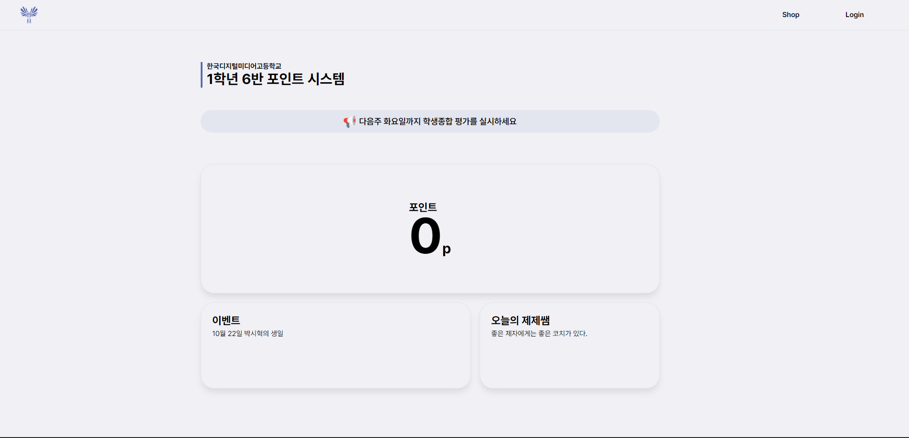

# Dimi6
This is a point system for Korea Media High School first grader of class 6. 
My class wanted a point system for class activities so I made it with Next.js.
## To do
- [ ] Make Login API to POST. Make user name and password be in body.
- [ ] Change status code.
## Technologies Used
### Next.js
- MySQL
- JWT 

